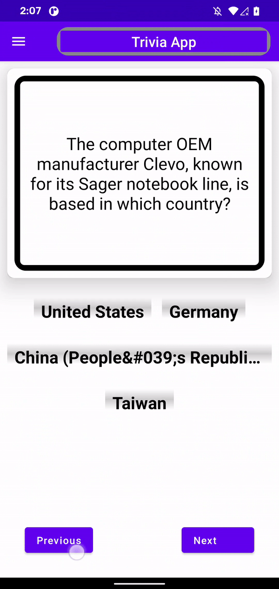

# Trivia App 

*Simple Trivia app using latest Jetpack Compose, ViewModel, Retrofit, Moshi, Experimental Coroutine StateFlow and* **https://opentdb.com** *api*

### Cloning Requirements 
*Many of the plugins used in this project are still experimental, hence you will need the following: *

**Android Studio Artic Fox | Canary 3**  ( At the moment )
**Java** *11+*

### Play the Game!!
*If you have a device running Android 6+, you can download the apk file from here*  [Trivia App Demo!](https://github.com/inehemiasm/TriviaApp-Jetpack_Compose/blob/main/Demo/app-debug.apk)

Thanks

